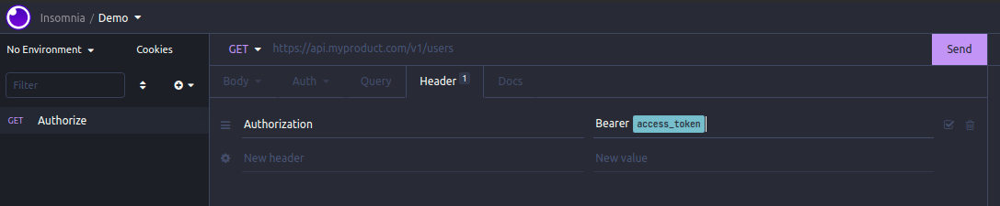

# Get Access Token

## Overview

This plugin simply makes a request to an authorization endpoint, extracts the access token from the response body using JSONPath or from a response header. Then saves it as template variable, so you can use it anywhere (environment, requests, etc.).

This was inspired on Swagger's **"Authorize"** button.

## Installation

#### One-Click installation
1. Go to http://insomnia.rest/plugins/insomnia-plugin-get-access-token
2. Click the **"Install plugin"** button.
3. Click **"Open Insomnia"** and **"Install"**

#### Install from plugins tab
1. Open Insomnia
2. Go to Application > Preferences > Plugins
3. Enter `insomnia-plugin-get-access-token`
4. Click **"Install Plugin"**

#### Manual installation
1. Open Insomnia plugins folder on a terminal window
2. `git clone https://github.com/jdinicola/insomnia-plugin-get-access-token`
3. `cd insomnia-plugin-get-access-token`
4. `npm install`

## Usage
Create an authorization request, add it the **TokenResponseHeader** header with the name of the response header that contains the token or the **JSONPath-filter** header with the filter value (JSONPath notation).

Examples:

```
// Using response TokenResponseHeader
Content-Length  36
Content-Type    application/json
Access-token    abcdef1234
...

// TokenResponseHeader would be "Access-token"
```

```
// Using JSONPath-filter
{
  "status": 200,
  "error": false,
  "body": {
    "access_token": "abcdef1234"
  },
  ...
}

// JSONPath-filter would be "$.body.access_token"
// Go to https://goessner.net/articles/JsonPath/ for a complete reference on JSONPath
```

After this, click on the authorization request actions (arrow on right) and click on "Authorize requests" option.


This creates a `access_token` template variable that you can use on environment, request URL, request header, etc.



## Contributing
Contributions, issues and feature requests are welcome. Feel free to open an [issue](https://github.com/jdinicola/insomnia-plugin-get-access-token/issues) or create a [pull request](https://github.com/jdinicola/insomnia-plugin-get-access-token/pulls).

<hr>


[Padlock](https://icons8.com/icon/12786/padlock) icon by [Icons8](https://icons8.com)